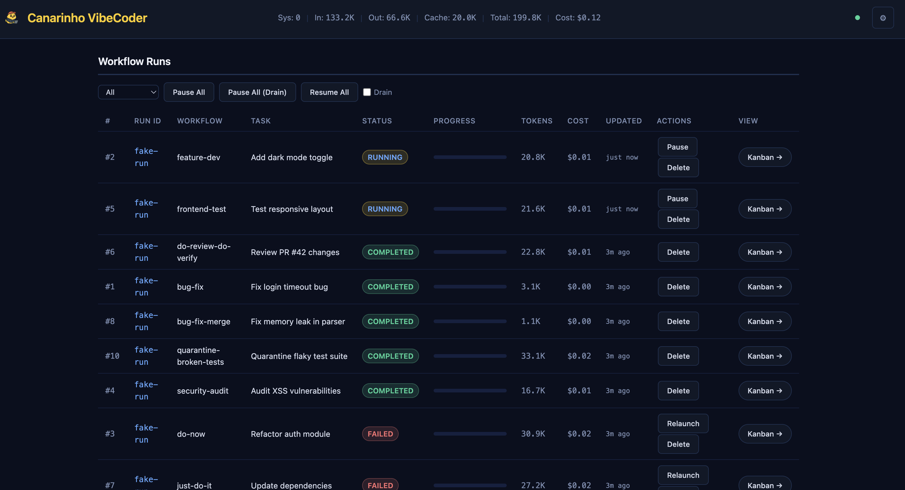
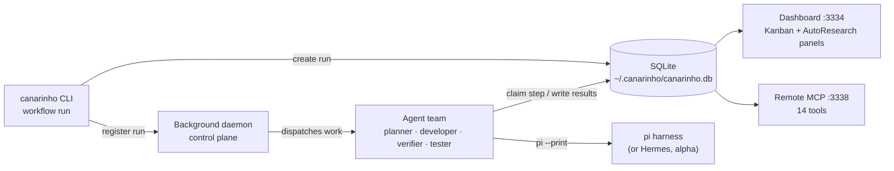
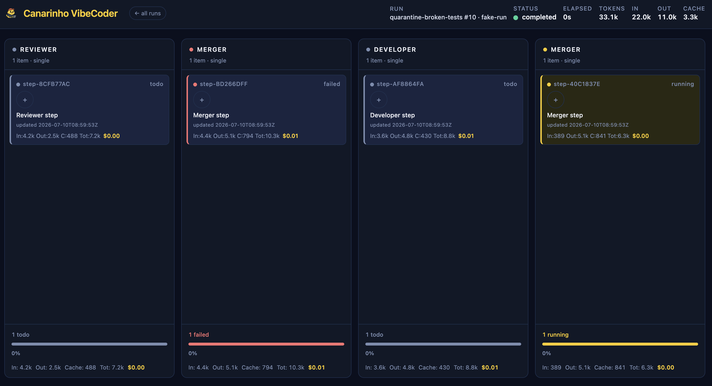

# Canarinho VibeCoder

<p align="center"></p>

<p align="center">
  <a href="LICENSE"></a>
  = 22">
  
  
  <a href="https://github.com/CanarinhoPistolaa/Canarinho-VibeCoder"></a>
</p>

Build your agent team in [pi](https://github.com/mariozechner/pi-coding-agent) with one command.

You don't need to hire a dev team. You need to define one. Canarinho VibeCoder gives you a team of specialized AI agents — planner, developer, verifier, tester, reviewer — that work together in reliable, repeatable workflows. One install. Zero infrastructure.

## Contents

- [Install from GitHub](#install-from-github)
- [Install from local checkout](#install-from-local-checkout)
- [Quickstart](#quickstart)
- [What You Get: Bundled Workflows](#what-you-get-bundled-workflows)
- [Why It Works](#why-it-works)
- [How It Works](#how-it-works)
- [Build Your Own](#build-your-own)
- [Dashboard UI](#dashboard-ui)
- [Workflow Creator](#workflow-creator)
- [Native AutoResearch](#native-autoresearch)
- [Security](#security)
- [Commands](#commands)
- [Requirements](#requirements)
- [License](#license) · [Origins](#origins)

### Install from GitHub

```bash
curl -fsSL https://raw.githubusercontent.com/CanarinhoPistolaa/Canarinho-VibeCoder/main/scripts/install.sh | bash
```

Or just tell your agent: **"Clone github.com/CanarinhoPistolaa/Canarinho-VibeCoder to my home dir, install it and learn the skill included inside it."**

### Install from local checkout

```bash
git clone https://github.com/CanarinhoPistolaa/Canarinho-VibeCoder.git
cd Canarinho-VibeCoder
./build-and-install
```

Or step by step:

```bash
./build        # npm install + tsc
./install      # symlink into ~/.local/bin
```

The `build` script handles everything: checks Node.js >= 22, runs `npm install`, compiles TypeScript. The `install` script creates a symlink at `~/.local/bin/canarinho` pointed at your checkout — so you can keep the source wherever you like and `canarinho` stays in sync. Both call into `scripts/install.sh` internally.

That's it. Run `canarinho workflow list` to see available workflows.

> **Not on npm.** canarinho is installed from source (or GitHub), not the npm registry.

> **Requires Node.js >= 22.** If `canarinho` fails with a `node:sqlite` error, make sure you're running real Node.js 22+, not Bun's node wrapper.

---

## Quickstart

Sixty seconds from install to a running agent team:

```bash
$ canarinho workflow install feature-dev

# Or install all bundled workflows at once
$ canarinho workflow install --all
✓ Installed workflow: feature-dev

$ canarinho workflow run feature-dev "Add user authentication with OAuth"
Run: a1fdf573
Workflow: feature-dev
Status: running

$ canarinho workflow status "OAuth"
Run: a1fdf573
Workflow: feature-dev
Steps:
  [done   ] plan (planner)
  [done   ] setup (setup)
  [running] implement (developer)  Stories: 3/7 done
  [pending] verify (verifier)
  [pending] test (tester)
```

Then watch your team work in real time:

```bash
$ canarinho dashboard    # web UI at http://localhost:3334
```

<p align="center"></p>

---

## What You Get: Bundled Workflows

canarinho ships with 23 bundled workflows organized into six families. Use `canarinho workflow list` to see available workflows, and `canarinho workflow install <id>` to install one.

### Worktree Variants

Worktree variants (`*-worktree`, `*-merge-worktree`) run in a detached git worktree
created from your origin repository. Your main working copy stays untouched until the
workflow completes. This gives you full isolation — continue working while agents
iterate — and a clean abort path: delete the worktree and nothing in your origin repo
has changed. The origin repository only sees changes when a `-merge` variant squashes
the result back into the original branch.

### Rugpull Handling

When a merge workflow (`-merge`, `-merge-worktree`) fails at the `finalize_merge`
step and the base branch tip has moved since the run started, canarinho automatically
launches a fresh replacement run with the same parameters. This "rugpull" detection
runs after the final merge failure — if the base branch stayed put, no replacement is
triggered. Pass `--no-relaunch-upon-rugpull` to `workflow run` to suppress the
automatic replacement.

### When runs fail

Rugpull replacement runs are narrowly scoped: they only apply to
`finalize_merge` step failures in merge workflows (`*-merge`,
`*-merge-worktree`) where the base branch tip moved during the run.
All other failures — mid-pipeline step retry exhaustion, expects
validation exhaustion, worker death — permanently fail the run
UNLESS the workflow declares `on_fail.retry_step`, in which case
the run reroutes to the named upstream producer (bounded by
`max_reroutes`, default 2 before falling through to permanent
failure). No automatic replacement is triggered for these failures.
Use `canarinho workflow resume <run-id>` to reattempt a permanently
failed run; fix the underlying issue before resuming.

### Feature Development

Story-based feature development. The planner decomposes your task into ordered user
stories. Each story goes through implement → verify → test before the next one starts.

<details>
<summary>Show the 5 Feature Development variants</summary>

| Variant | Workflow ID | Agents | Pipeline |
|---------|------------|--------|----------|
| Local-only | `feature-dev` | 5 | plan → setup → implement → verify → test |
| + Merge | `feature-dev-merge` | 6 | plan → setup → implement → verify → test → finalize_merge |
| Worktree | `feature-dev-worktree` | 5 | plan → setup → implement → verify → test |
| Worktree + Merge | `feature-dev-merge-worktree` | 6 | plan → setup → implement → verify → test → finalize_merge |
| GitHub PR | `feature-dev-github-pr` | 6 | plan → setup → implement → verify → test → pr → review |

</details>

**Local-only** stops after testing — commits stay on the feature branch, no merge or
PR. **+ Merge** variants add a `finalize_merge` step that squash-merges all commits
back into the original branch. **Worktree** variants run isolated in a detached worktree.
**GitHub PR** variants create a pull request and run a code review step.

### Bug Fix

Bug triage and fix. The triager reproduces the bug, the investigator finds the root
cause, the fixer patches it, and the verifier confirms the fix against acceptance
criteria.

<details>
<summary>Show the 5 Bug Fix variants</summary>

| Variant | Workflow ID | Agents | Pipeline |
|---------|------------|--------|----------|
| Local-only | `bug-fix` | 5 | triage → investigate → setup → fix → verify |
| + Merge | `bug-fix-merge` | 6 | triage → investigate → setup → fix → verify → finalize_merge |
| Worktree | `bug-fix-worktree` | 5 | triage → investigate → setup → fix → verify |
| Worktree + Merge | `bug-fix-merge-worktree` | 6 | triage → investigate → setup → fix → verify → finalize_merge |
| GitHub PR | `bug-fix-github-pr` | 6 | triage → investigate → setup → fix → verify → pr |

</details>

### Security Audit

Vulnerability scanning and patching. Scans for vulnerabilities, ranks by severity,
patches each one, re-audits after all fixes are applied, and runs regression tests.

<details>
<summary>Show the 5 Security Audit variants</summary>

| Variant | Workflow ID | Agents | Pipeline |
|---------|------------|--------|----------|
| Local-only | `security-audit` | 6 | scan → prioritize → setup → fix → verify → test |
| + Merge | `security-audit-merge` | 7 | scan → prioritize → setup → fix → verify → test → finalize_merge |
| Worktree | `security-audit-worktree` | 6 | scan → prioritize → setup → fix → verify → test |
| Worktree + Merge | `security-audit-merge-worktree` | 7 | scan → prioritize → setup → fix → verify → test → finalize_merge |
| GitHub PR | `security-audit-github-pr` | 7 | scan → prioritize → setup → fix → verify → test → pr |

</details>

### Quarantine Broken Tests

Detect failing tests, disable them minimally, and iterate until the full test suite
passes. Useful for establishing a clean baseline on a branch with known test failures.

<details>
<summary>Show the 3 Quarantine Broken Tests variants</summary>

| Variant | Workflow ID | Agents | Pipeline |
|---------|------------|--------|----------|
| Local-only | `quarantine-broken-tests` | 3 | setup → quarantine → verify |
| + Merge | `quarantine-broken-tests-merge` | 4 | setup → quarantine → verify → finalize_merge |
| Worktree + Merge | `quarantine-broken-tests-merge-worktree` | 4 | setup → quarantine → verify → finalize_merge |

</details>

### Quick Tasks

Single-agent workflows for quick one-off tasks and workflow auto-selection.

| Workflow ID | Agents | Pipeline | Description |
|------------|--------|----------|-------------|
| `do-now` | 1 | execute | Submit any task. Get back a success/failure report. No planning, no stories. |
| `just-do-it` | 1 | dispatch | Describe what you want. Dispatches to the most appropriate workflow automatically. For coding tasks (feature-dev*, bug-fix*, security-audit*) it defaults to merge-worktree variants unless the prompt gives a specific reason otherwise. |
| `do-review-do-verify` | 3 | do → review → do-again → verify | Two-pass execution: do the work, review it, revise, then verify the result. |

### Maintenance & Audits

Workflows for auditing and validating the project itself.

| Workflow ID | Agents | Pipeline | Description |
|------------|--------|----------|-------------|
| `frontend-test` | 1 | test | Builds the project and validates the dashboard frontend: HTML structure, route definitions, and test coverage. Does not start a second dashboard daemon. |
| `skills-normalize-audit` | 3 | scan → audit → report | Scans a skills directory, analyzes the skills for overlaps and redundancies, and produces consolidation recommendations in a structured report. |

Install all bundled workflows at once with:

```bash
$ canarinho workflow install --all
```

---

## Why It Works

- **Deterministic workflows** — Same workflow, same steps, same order. Not "hopefully the agent remembers to test."
- **Agents verify each other** — The developer doesn't mark their own homework. A separate verifier checks every story against acceptance criteria.
- **Fresh context, every step** — Each agent gets a clean session. No context window bloat. No hallucinated state from 50 messages ago.
- **Retry and reroute** — Failed steps retry automatically, and can be rerouted to upstream producers for fresh context. When budgets exhaust, the run fails — terminally and automatically. Nothing fails silently.
- **Zero tokens when idle** — Checking for work is a database peek, not a model call; agents spawn only when a step is ready, and completion nudges make step-to-step latency near zero. The old polling motor measured roughly 30% token overhead; the new motor: zero.

---

## How It Works

1. **Define** — Agents and steps in YAML. Each agent gets a persona, workspace, and strict acceptance criteria. No ambiguity about who does what.
2. **Install** — One command provisions everything: agent workspaces, scheduling, subagent permissions. No Docker, no queues, no external services.
3. **Run** — The scheduler checks for work deterministically (a DB peek — no model, no tokens) and spawns an agent only when a step is ready. Claim a step, do the work, pass context to the next agent. SQLite tracks state.



The motor's invariants are pinned by an engineering contract with acceptance tests and real-model baselines: [tests/MOTOR-CONTRACT.md](tests/MOTOR-CONTRACT.md).

### Minimal by design

YAML + SQLite + deterministic dispatch. That's it. No Redis, no Kafka, no container orchestrator. canarinho is a TypeScript CLI with zero external dependencies. It runs wherever pi runs. Checking for work never invokes a model — idle runs cost zero tokens.

---

## Build Your Own

The bundled workflows are starting points. Define your own agents, steps, retry logic, and verification gates in plain YAML and Markdown. If you can write a prompt, you can build a workflow.

```yaml
id: my-workflow
name: My Custom Workflow
agents:
  - id: researcher
    name: Researcher
    workspace:
      files:
        AGENTS.md: agents/researcher/AGENTS.md

steps:
  - id: research
    agent: researcher
    input: |
      Research {{task}} and report findings.
      Reply with STATUS: done and FINDINGS: ...
    expects: "STATUS: done"
```

Full guide: [docs/creating-workflows.md](docs/creating-workflows.md)

---

## Native AutoResearch

canarinho includes native AutoResearch primitives for measurable optimization loops.
Unlike a normal workflow, AutoResearch stores durable project-local state so an
agent can resume after restarts, learn from each measured run, and choose the next
experiment from evidence.

Use AutoResearch when the task has a reliable numeric metric and the agent should
run a sequence of experiments instead of one batch of edits. Typical examples are
raising test coverage, reducing validation loss, improving latency, or lowering
cost while preserving correctness.

```bash
canarinho autoresearch init \
  --goal "reduce validation loss" \
  --metric val_bpb \
  --direction lower \
  --command "uv run train.py"

canarinho autoresearch run-experiment
canarinho autoresearch log-experiment --status auto \
  --description "try lower learning rate" \
  --hypothesis "smaller LR improves stability" \
  --learned "validation improved but training slowed" \
  --next-focus "test warmup schedule"
canarinho autoresearch next

# Inspect the loop for a canarinho workflow run
canarinho workflow autoresearch <run-id>
```

### Triggering AutoResearch

AutoResearch can be driven manually from any project directory, or delegated to a
canarinho workflow agent. In both cases the project needs a metric command that
prints one parseable number. The command should be deterministic enough to compare
experiments and should exclude generated or third-party code when measuring a
project-owned objective.

Manual loop:

```bash
cd /path/to/project

canarinho autoresearch init \
  --goal "Increase unit test coverage to 1.000 without changing application code" \
  --metric coverage \
  --unit ratio \
  --direction higher \
  --command "./measure-test-coverage.sh" \
  --metric-regex "^([0-9]\\.[0-9]{3})$" \
  --checks-command "./measure-test-coverage.sh"

canarinho autoresearch run-experiment
canarinho autoresearch log-experiment --status auto \
  --description "baseline coverage" \
  --hypothesis "establish current coverage" \
  --learned "baseline recorded" \
  --next-focus "cover the lowest-risk uncovered module"
canarinho autoresearch next
```

Workflow-driven loop:

```bash
canarinho workflow install do-now
canarinho dashboard start

canarinho workflow run do-now \
  "In the target repo, create or verify ./measure-test-coverage.sh, initialize canarinho autoresearch, then run 10 bounded experiments. Before each edit run canarinho autoresearch next. Only add or change tests/fixtures/test config. After each experiment run canarinho autoresearch run-experiment and canarinho autoresearch log-experiment --status auto with description, hypothesis, learned, and next-focus. Stop and report best metric, commits, and remaining gaps." \
  --working-directory-for-harness /path/that/contains/or/is/the/project \
  --pi-as-harness
```

Monitor it while the workflow runs:

```bash
canarinho workflow status <run-id>
canarinho workflow autoresearch <run-id>
open http://localhost:3334
```

The dashboard's AutoResearch panel reads the run's harness working directory,
discovers the nearest `autoresearch.config.json` / `autoresearch.jsonl`, and
renders the experiment trace. Gray points are attempted experiments; green points
and the green line are the kept best-so-far frontier.

### Session Registry

canarinho maintains a SQLite registry of AutoResearch sessions so the dashboard
can discover them directly without scanning workflow runs. The registry lives in
a table called `autoresearch_sessions` inside the main canarinho database
(`~/.canarinho/canarinho.db`).

- **Project-local files are the source of truth.** `autoresearch.config.json`,
  `autoresearch.jsonl`, `autoresearch.md`, and `autoresearch.sh` remain on disk
  in your project. The DB registry is an index/cache for discovery and dashboard
  UX — it never modifies your project files.
- **Sessions are registered automatically.** Every `canarinho autoresearch` command
  (init, run-experiment, log-experiment, status, next, loop) updates or creates
  the registry entry for that project directory.
- **Backfill on dashboard start.** When the dashboard starts, it scans recent
  workflow runs for harness directories that contain AutoResearch files and
  backfills any missing registry entries.

### Pruning Stale Registry Entries

Use `canarinho autoresearch prune` to clean up stale registry rows without
removing any project-local files.

```bash
# Prune sessions not updated in 30 days
canarinho autoresearch prune --older-than 30d

# Prune only sessions whose project files no longer exist
canarinho autoresearch prune --older-than 7d --missing

# Preview what would be pruned without deleting
canarinho autoresearch prune --older-than 30d --dry-run
```

The prune command only touches the SQLite registry — your `autoresearch.jsonl`,
config files, and experiment history remain untouched on disk.

### Example Experiment

For a test-coverage loop, a single experiment should be narrow enough to explain
before editing and measurable enough to keep or discard after the run.

```bash
# 1. Ask the ratchet what evidence should drive the next edit.
canarinho autoresearch next

# Example returned focus:
# Best run 1: 0.336 ratio
# Next focus: cover pure helpers in batch_processor without touching application code

# 2. Make one focused test-only change.
# Example hypothesis:
# "Adding unit tests for batch_processor pure helper functions will increase
# coverage without requiring Spark or changing runtime code."

# 3. Measure and log the result.
canarinho autoresearch run-experiment
canarinho autoresearch log-experiment --status auto \
  --description "cover batch_processor pure helpers" \
  --hypothesis "pure-helper tests increase coverage without Spark" \
  --learned "coverage increased from 0.336 to 0.477; helper paths are now covered" \
  --next-focus "cover utils.py pure helpers and runtime stubs"
```

If the metric improves in the configured direction and checks pass, the logged run
is kept. If it regresses, crashes, or fails checks, it is logged as discarded,
crash, or checks_failed; with `--revert-discard`, canarinho can revert non-state
experiment files while preserving `autoresearch.jsonl`.

Project files:

| File | Purpose |
|------|---------|
| `autoresearch.config.json` | Session config: goal, metric, direction, command, parser, checks. |
| `autoresearch.md` | Agent-facing objective and operating loop. |
| `autoresearch.jsonl` | Append-only run history: measured results, decisions, learning, next focus. |
| `autoresearch.sh` | Benchmark command. |
| `autoresearch.checks.sh` | Optional correctness checks run after successful measurements. |

When a workflow run was started with `--working-directory-for-harness`, the
dashboard includes an AutoResearch panel that reads that directory's
`autoresearch.jsonl` and shows best/baseline metrics, kept/discarded counts,
failures, and the recent learning timeline.

The core loop is `init -> run-experiment -> log-experiment -> next`. `log --status auto` classifies a
run as `baseline`, `keep`, `discard`, `crash`, `metric_not_found`, or `checks_failed` by comparing the
latest metric with prior accepted results (`metric_not_found` when the command exits 0 but the metric cannot be parsed from its output — such runs do not update best/baseline). The `next` prompt carries the ratchet:
it restates the goal, best result, last learning, and next focus before the agent
starts another experiment.

---

## Security

You're installing agent teams that run code on your machine. We take that seriously.

- **Curated repo only** — canarinho only installs workflows from the official repository. No arbitrary remote sources.
- **Reviewed for prompt injection** — Every workflow is reviewed for prompt injection attacks and malicious agent files before merging.
- **Community contributions welcome** — Want to add a workflow? Submit a PR. All submissions go through careful security review before they ship.
- **Transparent by default** — Every workflow is plain YAML and Markdown. You can read exactly what each agent will do before you install it.

---

## Dashboard UI

The web dashboard (`canarinho dashboard`) includes:

- **Progress bar colors by status** — running=blue, completed=green, paused=yellow, failed=red
- **Responsive mobile cards** — flexbox layout that prevents label/value overlap on small screens
- **Token formatting** — K/M/B/T abbreviations (e.g. 156K, 1.2M)
- **Settings popover** — theme switcher (GitHub Dark, Cool Slate, Canarinho), MCP status, navigation

## Workflow Creator

Build custom workflows through the web UI at `/workflows`:

- **Workflow List** — view all workflows with agents/steps expand, Clone/Edit/Delete actions
- **Workflow Editor** — create/edit workflows with Info, Agents, Steps, and live YAML preview
- **Agent Editor** — define agents with role, model override, skills, and persona files (AGENTS.md, IDENTITY.md, SOUL.md)
- **Step Editor** — configure steps with agent dropdown, single/loop type, input templates, and loop config
- **Import Agent** — reuse agents from any workflow with one click
- **Clone** — clone any workflow to start from an existing template

Access at `http://localhost:3334/workflows` or click Settings → Workflows.

---

## Troubleshooting

If something isn't working as expected, start with the built-in diagnostic:

- **Run `canarinho doctor`** — One-shot diagnostic that checks environment (Node.js >= 22, pi on PATH, gh on PATH), services (dashboard daemon, control plane, MCP), daemon staleness (running daemon matches installed build), database state (run-level anomalies), and LLM prompt adherence (per-step key-emission rates from workflow runs, measuring how often agents deliver expected output keys). Each check prints **pass/fail** status and on failure prints the **exact remedy command** to run.
- **Check dashboard status** — Run `canarinho dashboard status` to verify the daemon and control plane are running on their expected ports.
- **Check logs** — Run `canarinho logs` to see recent daemon events. For live tailing: `canarinho logs-tail`.
- **Restart the daemon** — If the dashboard or control plane is unresponsive, run `canarinho dashboard restart`. This stops the daemon, rebuilds, and restarts it.

---

## Commands

### Lifecycle

| Command | Description |
|---------|-------------|
| `canarinho get-ready` | Install bundled workflows and start dashboard/control plane |
| `canarinho source-path` | Print the canarinho source checkout path |
| `canarinho skill-path` | Print the path to the bundled canarinho-agents agent skill |
| `canarinho update [--force]` | Pull the source checkout, rebuild, reinstall workflows (refreshes all installed bundled workflow files — local edits are overwritten), and restart previously running services |
| `canarinho uninstall [--force]` | Full teardown (agents, crons, DB) |

### Workflows

| Command | Description |
|---------|-------------|
| `canarinho workflow run <id> <task> [--working-directory-for-harness <dir>] [--pi-as-harness \| --hermes-as-harness]` | Start a run (defaults harness CWD to your current directory) |
| `canarinho workflow status <query>` | Check run status |
| `canarinho workflow runs` | List all runs |
| `canarinho workflow resume <run-id>` | Resume a failed run |
| `canarinho workflow delete <run-id> [--force]` | Permanently delete a workflow run and associated data |
| `canarinho workflow list` | List available workflows |
| `canarinho workflow install <id> [--all]` | Install one or all workflows. **Installed bundled definitions are refreshed on every install/update** — local edits are overwritten. To customize a workflow, copy it under a new workflow id. |
| `canarinho workflow uninstall <id>` | Remove a single workflow |

### Management

| Command | Description |
|---------|-------------|
| `canarinho dashboard` | Start the web dashboard (also starts remote MCP on `http://localhost:3338/mcp`) |
| `canarinho dashboard start\|stop\|restart\|status [--port N]` | Manage the dashboard daemon |
| `canarinho mcp start\|stop\|restart\|status [--port N]` | Manage the standalone MCP server |
| `canarinho control-plane start\|stop\|restart\|status [--port N]` | Manage the standalone control plane |
| `canarinho logs [<lines>|<run-id>|#<run-number>]` | View recent log entries |
| `canarinho logs-tail [<lines>|<run-id>|#<run-number>]` | Follow recent activity as new events arrive |
| `canarinho nudge` | Trigger an immediate dispatch round for all running runs |

When you start the management dashboard (`canarinho dashboard`), canarinho automatically starts the remote MCP server too.

- Dashboard: `http://localhost:3334` (or your custom `--port`)
- MCP endpoint: `http://localhost:3338/mcp` (fixed port)

Use `canarinho dashboard status` to verify both endpoints are up.

#### Kanban view

Each run also has a swim-lane view at `http://localhost:3334/runs/<run-id>/kanban`
(linked from the run-ID in the dashboard's runs table). Lanes are derived
dynamically from the workflow's steps: single steps render one card per lane,
loop steps (e.g. the developer agent iterating over user stories) render one
card per story. Cards are colour-coded by status (todo / running / done /
failed) and the page polls `/api/runs/<run-id>/kanban` every 3 seconds. The
JSON endpoint is also useful for external integrations — see
`src/server/kanban-data.ts` for the response shape.

<p align="center"></p>

### Harness Selection

By default, canarinho uses **pi** (`pi --print`) as its agent harness. You can
override this with the harness selection flags on `canarinho workflow run`:

| Flag | Description |
|------|-------------|
| `--pi-as-harness` | Use pi as the agent harness. **This is the default.** |
| `--hermes-as-harness` | Use [Hermes](https://github.com/nicholasgasior/hermes) as the agent harness instead of pi. |

These flags are **mutually exclusive** — specifying both is an error.

#### Hermes Support (Alpha)

> **⚠️ Alpha quality.** Hermes harness support is in **alpha** and has known
> limitations: it is **very slow** compared to pi. Token usage is read from
> hermes' state.db after each round (best-effort: falls back to 0 tokens with a
> warning if the hermes schema is unavailable or changed).
> Use pi (`--pi-as-harness`) for production workflows.

To use a custom Hermes binary path, set the `canarinho_HERMES_BINARY`
environment variable:

```bash
export canarinho_HERMES_BINARY=/path/to/hermes
```

If `canarinho_HERMES_BINARY` is not set, canarinho searches for `hermes` on your
`PATH`. The harness validation runs at scheduling time — if the Hermes binary
isn't found or isn't executable, the run fails immediately with a clear error.

##### Hermes E2E Canary

`./run-hermes-e2e-canary` is an **opt-in** end-to-end canary that validates
the full Hermes pipeline against the real Hermes binary. It launches a single
trivial workflow run (`--hermes-as-harness`) through the daemon, scheduler, and
Hermes harness, then audits the token-attribution chain:
`session_id` trailer → `state.db` lookup → `runs.tokens_spent` > 0.

> **⚠️ Spends real tokens and is very slow (30+ minutes).** The canary is
> never part of `./run-all-e2e-tests` or `npm test`. Run it manually after
> Hermes upgrades or when changing the harness adapter.

```bash
./run-hermes-e2e-canary
```

The test **silently skips** with a clear message when no Hermes binary is
found on `PATH` or via `canarinho_HERMES_BINARY`. A temporary isolated canarinho
home is created for each run, but `~/.hermes` is symlinked in so the real
Hermes binary can find its credentials and config.

##### Doctor Contract Check

`canarinho doctor` includes a Hermes `state.db` contract check in its
ENVIRONMENT group. When a Hermes binary is found, the doctor probes
`$HERMES_HOME/state.db` (read-only, no Hermes invocation, no tokens) and
verifies the `sessions` table contains all columns required for token
accounting: `input_tokens`, `output_tokens`, `cache_read_tokens`,
`cache_write_tokens`.

- **Contract OK** → `info`: "hermes state.db contract OK — token accounting
  available"
- **Contract broken** → `warn`: "hermes state.db contract broken: <reason>.
  Hermes runs will report 0 tokens."
- **No Hermes binary** → the check is omitted entirely.

This is a cheap schema probe that catches Hermes-side breakage (new
`state.db` format, renamed columns) before a production run silently reports
zero tokens.

### Remote MCP tools

The remote MCP endpoint exposes 14 tools:

#### Run Management

| Tool | Description |
|------|-------------|
| `canarinho.runs.list` | List recent canarinho workflow runs. Accepts optional `limit` (integer, 1–200, default 50). |
| `canarinho.run.status` | Fetch detailed status for a run. Requires `query` (run id, prefix, or task substring). |
| `canarinho.run.start` | Start a workflow run. Requires `workflowId` and `taskTitle`. |
| `canarinho.run.pause` | Pause a running workflow run. Requires `runId`. Optional `drain` (boolean) to wait for in-flight work before pausing. |
| `canarinho.run.resume` | Resume a paused workflow run. Requires `runId`. |
| `canarinho.run.delete` | Permanently delete a workflow run and associated steps, stories, and worktree metadata. Requires `runId`. Optional `force` (boolean) cancels and deletes running or paused runs. |

#### Events & Metadata

| Tool | Description |
|------|-------------|
| `canarinho.events.recent` | List recent global canarinho events. Accepts optional `limit` (integer, 1–500, default 50). |
| `canarinho.source.path` | Return the local canarinho source checkout path. No parameters. |
| `canarinho.skill.path` | Return the path to the bundled canarinho-agents agent skill. No parameters. |
| `canarinho.update.command` | Return local CLI guidance for updating canarinho safely. No parameters. |

#### AutoResearch

| Tool | Description |
|------|-------------|
| `canarinho.autoresearch.init` | Create project-local AutoResearch state. Requires `cwd`, `goal`, `metricName`, `direction`, and `command`. Optional `metricUnit`, `metricRegex`, `checksCommand`, and `overwrite`. |
| `canarinho.autoresearch.run_experiment` | Run the configured experiment command in `cwd`, parse the metric, run optional checks, and append a `run_result`. Optional `command`, `metricRegex`, `checksCommand`, and `timeoutMs`. |
| `canarinho.autoresearch.log_experiment` | Append the decision and learning for the latest run. Requires `cwd` and `description`; optional `status`, `metric`, `hypothesis`, `learned`, `nextFocus`, `commit`, and `revertDiscard`. |
| `canarinho.autoresearch.status` | Summarize baseline, best result, failures, and the next ratchet prompt for `cwd`. |

#### `canarinho.run.start` Parameters

| Parameter | Required | Description |
|-----------|----------|-------------|
| `workflowId` | Yes | Workflow id to run. |
| `taskTitle` | Yes | Task description for the workflow run. |
| `workingDirectoryForHarness` | For direct workflows | Harness working directory for remote MCP runs. Required for direct workflows, invalid for worktree workflows. |
| `worktreeOriginRepository` | For worktree workflows | Repository path to create the worktree from. Required for worktree workflows, invalid for direct workflows. |
| `worktreeOriginRef` | No | Git ref (branch, tag, SHA) for the worktree. Optional. Only valid for worktree workflows. |
| `noHurrySaveTokensMode` | No | When `true`, work spawns prefer a `<harness>-token-saver` wrapper from PATH over the plain harness binary (`pi-token-saver` for pi runs, `hermes-token-saver` for hermes runs; per invocation; falls back to the plain binary when absent). Idle dispatch is free either way. Optional, defaults to `false`. |

`workingDirectoryForHarness` and `worktreeOriginRepository` are **mutually exclusive**: direct workflows require the former, worktree workflows require the latter. Supplying the wrong one or both results in an invalid-params error.

---

## Requirements

- Node.js >= 22
- [pi](https://github.com/mariozechner/pi-coding-agent) installed on the host
  - canarinho uses pi for AI agent execution. Agents run via `pi --print` in non-interactive mode.
- `gh` CLI for PR creation steps

---

## License

[MIT](LICENSE)

---

## Origins

Canarinho VibeCoder began as a fork of [canarinho](https://github.com/igorhvr/canarinho) which itself forked [antfarm](https://github.com/snarktank/antfarm) — pursuing the same goal of orchestrating teams of AI agents through deterministic, repeatable workflows — built on top of [pi](https://github.com/mariozechner/pi-coding-agent). Credit to the original authors for the design and inspiration.

---

Built with Canarinho VibeCoder in mind.
